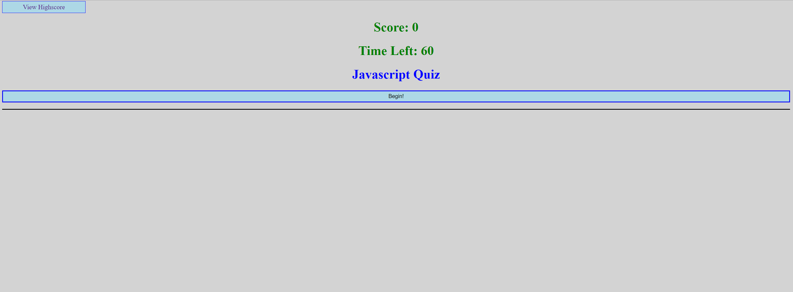

# Homework4
This project was brutal. 

HTML:
index.html is my quiz page.
highscore.html is my highscore page.

highscore.css is styling dedicated to highscore.html
style.css is style dedicated to index.html

highscore.js exists to pull from local storage and update the current highscore.

javascript.js was very difficult. Once I figured out how to dynamically update my questions and answers, things improved. 
My next hurdle was figuring out how to trigger the next function without having previous question sets running at the same time.
Then I had to figure out how to create a setinterval timer to track a global timer, I have yet to figure out how to reduce the remaining seconds with wrong answers, every iteration of this either exponentially reduced time, or didn't work.  
Finally I had to track highscores only if the current score is greater than the users highscore, and store it locally for persistance, and to pull in the highscore page.

Finally I refractored the entire javascript to improve functionality and reduce code redundancy.

## Live Deploy

# ReadmeGenerator

# Contact
Vygoth
JeremyJoanet@Protonmail.com

## Description
This Application allows users to create README files on the fly!

## Table of Contents
- [Usage](#Usage)
- [Installation](#Dependancies)
- [Testing](#Testing)
- [Credits](#Credits)
- [License](#License)
- [Contributing](#Contributing)
- [License Information](#LicenseInfo)
- [Screenshot](#Screenshot)

## Usage
To begin this application, please type node index.js with node installed.

## Dependancies
npm i

## Testing
N/A

## Credits
Zach Duty, Matt Reisdorf

## Contributing
N/A

## Screenshot

